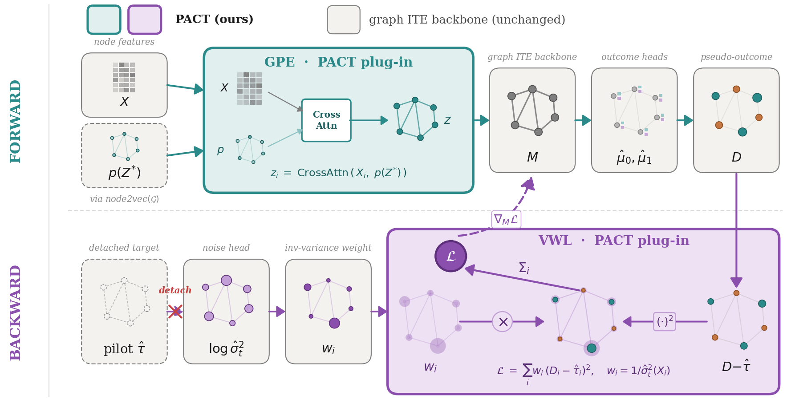
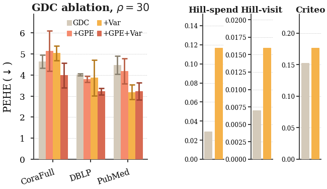

# PACT: Graph Positional Encoding and Variance-Weighted Learning as Universal Plug-ins for Uplift Modeling

This repository provides the official implementation and experiment artifacts for **PACT** — two orthogonal, architecture-agnostic plug-ins for graph-based Individual Treatment Effect (ITE) estimation:

1. **GPE (Graph Positional Encoding)**: multi-head cross-attention that fuses node features with node2vec positional embeddings, injecting community-/position-level structural information that standard message-passing GNNs cannot recover.
2. **VWL (Variance-Weighted Learning)**: an inverse-variance sample reweighting scheme that targets heteroscedastic outcome noise. A learned $\log\sigma^2$ head handles continuous outcomes; an analytical Bernoulli variance $\mu(1{-}\mu)$ handles binary outcomes.

Both modules attach to existing graph-ITE backbones without architecture changes. A **dual-root confounder** framing (a latent structural position $Z^*$ that simultaneously biases treatment assignment and drives heteroscedastic noise) motivates the modularity and predicts where each plug-in should — and should not — help.

## Method Overview

<p align="center">
  
</p>

<p align="center"><i>One PACT training step. <b>Forward (top)</b>: GPE fuses node features with node2vec positional embeddings via cross-attention, feeding the fused representation into any GNN backbone. <b>Backward (bottom)</b>: VWL reweights the pseudo-outcome loss by estimated per-sample inverse variance; the pilot tau is gradient-detached.</i></p>

## Key Results

**GPE is a plug-in that works across backbones** (mean $\Delta$PEHE across 90 cells = 15 cells $\times$ 6 separate-head backbones on CoraFull/DBLP/PubMed with $\rho \in \{5,10,15,20,30\}$, 5 seeds each; Wilcoxon $p < 10^{-5}$):

| Backbone | Mean $\Delta$PEHE | W/T/L (of 15 cells) |
|---|---|---|
| TARNet (T-learner) | **-13.5%** | 15/0/0 |
| NetDeconf (2020) | **-9.6%** | 13/0/2 |
| GDC (2025 SOTA) | **-9.4%** | 12/0/3 |
| GIAL (2021) | **-9.2%** | 14/0/1 |
| GNUM (2023) | **-6.2%** | 13/0/2 |
| X-learner | **-3.4%** | 9/0/6 |
| BNN (S-learner) | +0.9% | 1/1/13 |

Gain orders by bias-pathway headroom as theory predicts: TARNet (no internal position absorption) $\to$ X-learner (cross-fitted pseudo-outcome already exploits position via $\mu_{1-t}$). BNN essentially never benefits (only 1 win across 15 cells, within seed noise) — S-learner architectures cannot condition on position independently of treatment.

<p align="center">
  
</p>

<p align="center"><i>Ablations. <b>Top</b>: GDC at ρ=30 across CoraFull, DBLP, PubMed — VWL alone drives the gain on variance-dominated PubMed; joint GPE+VWL wins on bias-dominated CoraFull and DBLP. <b>Bottom</b>: relative Qini lift from variance weighting on three tabular settings.</i></p>

**VWL delivers complementary gains in variance-dominated regimes**:
- Continuous Hillstrom spend: **+303% Qini** (0.029 → 0.117, 4×) — design regime of the learned $\log\sigma^2$ head.
- Unbalanced binary Hillstrom-visit: **+129% Qini** (0.007 → 0.016).
- Balanced binary Criteo: **+16% Qini** (0.153 → 0.177).
- GDC at high noise: VWL alone cuts PEHE by up to **-29%** on variance-dominated cells; joint GPE+VWL up to **-20%** on bias-dominated cells.

## Repository Structure

```
pact/                        # Core package
├── layers.py                # Hand-rolled multi-head GAT + GCN (no PyG layer dependency)
├── graphformer_layer.py     # Sparse Graphformer for the Appendix-B comparison
├── fusion.py                # GPE: cross-attention fusion of features + node2vec
├── heads.py                 # X-learner heads: mu_t, tau_t, log-sigma2_t, propensity
├── model.py                 # PACT assembly + BNN/TARNet/X graph variants
├── baselines.py             # NetDeconf, GIAL, GNUM, GDC with plug-in compatibility
├── losses.py                # Masked X-learner loss, variance-weighted MSE, Bernoulli variant
├── metrics.py               # PEHE, ATE, Qini, AUUC, Lift@k
├── dgp.py                   # Semi-synthetic DGP (SVD + community bias + heteroscedasticity)
├── data.py                  # Dataset loaders (CoraFull/DBLP/PubMed, BlogCatalog/Flickr, tabular)
├── train.py                 # Graph and tabular training loops
├── main.py                  # CLI entry point
├── pregenerate.py           # Pre-cache DGP samples for ablation sweeps
├── summarize.py             # Aggregate per-run JSONs into markdown tables
├── gen_tables.py            # Produce paper-ready tables
├── configs/                 # YAML configs: cora_full, dblp, pubmed, criteo, server/
└── experiments/             # Runnable ablations (see Reproducing Paper Results)
    ├── run_gdc_5seed_ablation.py       # Figure 3 top (GDC at rho=30, 5 seeds)
    ├── run_graphformer_comparison.py   # Appendix B: Graphformer vs GAT+GPE
    ├── run_no_community_ablation.py    # Appendix B: kappa_4=0 ablation
    ├── run_pe_comparison.py            # Appendix B: node2vec vs Laplacian vs degree+PR
    └── plot_auc_pehe_correlation.py    # Section 5.5 propensity-AUC vs delta-PEHE scatter

scripts/                     # Shell launchers for the main ablation grid
supplementary/               # Auxiliary experiments, walltime benchmark, t-SNE, tuning sweeps
results/                     # Aggregated per-experiment JSON + markdown summary tables
images/                      # Method figure + ablations figure
run_5seed_full.sh            # Seeds 3-4 extension for the full grid
run_all_experiments.sh       # Master runner for GDC ablation + Graphformer + no-community
aggregate_5seed.py           # Consolidate seed sweeps into the Table-1 schema
```

## Installation

Tested on Python 3.12 + PyTorch 2.6 (CUDA 12.4) with a single NVIDIA GPU. 24 GB VRAM is enough for all the experiments in the paper; 48 GB lets you keep the default batch sizes.

```bash
# 1. Clone the repository
git clone <repo-url> PACT && cd PACT

# 2. Create the conda environment
conda create -n pact python=3.12
conda activate pact

# 3. Install PyTorch (adjust the CUDA index-url for your driver — see pytorch.org)
pip install torch --index-url https://download.pytorch.org/whl/cu124

# 4. Install the remaining dependencies
pip install torch-geometric scipy numpy networkx python-louvain gensim \\
            pandas pyyaml scikit-uplift pyarrow matplotlib seaborn tqdm
```

**Runs on CPU too.** Append `--device cpu` to any `pact.main` command. Expect longer wall-clock — `pact.main --smoke` is the recommended CPU sanity check.

## Data setup

Raw datasets are not shipped with this repo. Place them under a directory of your choice (default: `./data/`) and point the YAML configs at it.

```
data/
├── CoraFull/        # torch_geometric.datasets.CitationFull (auto-downloads on first run)
├── DBLP/            # torch_geometric.datasets.CitationFull
├── PubMed/          # torch_geometric.datasets.CitationFull
├── wsdm_datasets/   # Guo et al. 2020 — BlogCatalog & Flickr
│   ├── BlogCatalog/
│   └── Flickr/
└── tabular/         # scikit-uplift benchmarks (auto-downloads on first use)
    ├── hillstrom.csv
    ├── criteo.csv
    └── ...
```

The three citation graphs (CoraFull / DBLP / PubMed) auto-download via `torch_geometric`. For BlogCatalog / Flickr, download from the [NetDeconf repository](https://github.com/rguo12/network-deconfounder-wsdm20) and place the folders under `data/wsdm_datasets/`. The tabular benchmarks are fetched by `scikit-uplift` on first use.

## Configuration

Every experiment is driven by a YAML config (`pact/configs/<dataset>.yaml`). Example for CoraFull:

```yaml
dataset:
  name: CoraFull
  root: data/CoraFull                       # ← point this at your data location
  pos_emb_path: data/CoraFull_gpe_128.npy   # ← node2vec cache (auto-generated on first run)
dgp:
  rho: 10.0       # heteroscedastic noise scale
model:
  pos_dim: 128
  fusion_embed_dim: 256
  use_gpe: true
  use_variance: true
  backbone: gat   # gat | gcn | graphformer
train:
  epochs: 200
  lr: 1.0e-3
  seed: 0
```

Override any YAML field from the CLI (e.g. `--rho 15`) or via environment variables:

```bash
export CONDA_ENV=pact                      # conda env name used by scripts (default: pact)
export REPO_ROOT=/path/to/PACT             # auto-detected, usually unneeded
```

If you want dataset paths baked in for reproducibility on your machine, copy `pact/configs/*.yaml` to `pact/configs/server/` (which is gitignored) and edit paths there.

## Quick Start

```bash
# 1. Smoke test — tiny synthetic graph, ~30 s on CPU, no data download required
python -m pact.main --smoke --device cuda

# 2. Full PACT (GPE + VWL) on CoraFull, default rho
python -m pact.main --config pact/configs/cora_full.yaml --device cuda --learner pact

# 3. Vanilla TARNet (no GPE, no VWL) — reference baseline
python -m pact.main --config pact/configs/cora_full.yaml --device cuda --learner tarnet --no-gpe

# 4. GDC (2025 SOTA) with GPE + VWL plug-ins
python -m pact.main --config pact/configs/cora_full.yaml --device cuda --learner gdc --use-variance

# 5. Tabular: Hillstrom spend (continuous outcome, VWL design regime)
python -m pact.main --mode tabular --config pact/configs/criteo.yaml --learner x --use-variance --device cuda
```

Each run writes `runs/<timestamp>/<learner>__rho<rho>__seed<seed>.json` (metrics) and a `.log` file. Aggregate multiple seeds via `python aggregate_5seed.py` once runs finish.

## Reproducing Paper Results

### 1. Pre-generate DGP caches (one-time, ~80 min total)
```bash
python -m pact.pregenerate --out-dir runs/data_cache
```

### 2. Main GPE plug-in grid (Table 1 and Table 2)
```bash
# Meta-learners and SOTA baselines x {vanilla, +GPE} on CoraFull/DBLP/PubMed x 5 rhos x 5 seeds
bash scripts/run_gpe_ablation.sh
bash scripts/run_sota_ablation.sh
```

### 3. Variance weighting grid (Figure 3 top and Section 5.3)
```bash
python -m pact.experiments.run_gdc_5seed_ablation --device cuda --cache-dir runs/data_cache
```

### 4. Tabular VWL (Figure 3 bottom and Section 5.4)
```bash
bash scripts/run_tabular_ablation.sh
```

### 5. Community-detection sensitivity (Table 3)
```bash
bash scripts/run_comm_sens.sh
```

### 6. Mechanism analysis and Appendix B robustness
```bash
python -m pact.experiments.run_pe_comparison --device cuda              # PE method: node2vec / Laplacian / degree+PR
python -m pact.experiments.run_graphformer_comparison --device cuda     # Graphformer backbone comparison
python -m pact.experiments.run_no_community_ablation --device cuda      # kappa_4=0 (no intra-community edge boost)
python supplementary/run_gpe_mechanism.py --device cuda                 # H1 (propensity AUC) and H2 (MMD) analysis
python supplementary/bench_gpe_walltime.py                              # O(n^2) vs O(n) walltime comparison
```

### 7. Aggregate into paper-ready tables
```bash
python aggregate_5seed.py
python -m pact.summarize runs/<timestamp>
python -m pact.gen_tables results/all_merged.json
```

## CLI Reference

```
python -m pact.main [OPTIONS]

  --mode graph|tabular     Graph (transductive) or tabular (mini-batch) training [default: graph]
  --config PATH            YAML config file
  --learner NAME           s | t | x | pact | bnn | tarnet | netdeconf | gial | gnum | gdc

  --no-gpe                 Disable Graph Positional Encoding
  --use-variance           Enable Variance-Weighted Learning (auto-on for learner=pact)
  --no-variance            Force-disable variance weighting

  --rho FLOAT              Heteroscedastic noise scale for the graph DGP
  --seed INT               Random seed
  --epochs INT             Training epochs [default: 200]
  --device cpu|cuda
  --cache-dir PATH         Load pre-generated DGP samples (skips DGP resampling)

  --out-json PATH          Write best-epoch metrics as JSON
  --tag STRING             Tag for results aggregation
  --smoke                  Run the minimal synthetic smoke test
```

## Datasets

### Graph (semi-synthetic, oracle ITE available)
| Dataset | Nodes | Edges | Features | Source |
|---|---|---|---|---|
| CoraFull | 19,793 | 126,842 | 8,710 | PyG CitationFull |
| DBLP | 17,716 | 105,734 | 1,639 | PyG CitationFull |
| PubMed | 19,717 | 88,648 | 500 | PyG CitationFull |
| BlogCatalog | 5,196 | 343,486 | 2,160 | Guo et al. WSDM 2020 |
| Flickr | 7,575 | 12,047 | 12,047 | Guo et al. WSDM 2020 |

Cora/DBLP/PubMed use our semi-synthetic DGP (community-boosted treatment, multi-hop spillover, per-node heteroscedastic noise controlled by rho). BlogCatalog/Flickr use the NetDeconf DGP directly for cross-DGP validation.

### Tabular (real-world observational uplift)
| Dataset | Rows | Outcome | Source | Role |
|---|---|---|---|---|
| Hillstrom (spend) | 64K | Continuous | MineThatData | Primary VWL showcase ($\log\sigma^2$ head design regime) |
| Hillstrom (visit) | 64K | Binary ($\mu \approx 0.15$) | MineThatData | Unbalanced-binary scope |
| Criteo Uplift | 13.9M | Binary | Criteo AI Lab | Balanced-binary scope |
| X5, Lenta, RetailHero | 200K, 690K, 200K | Binary ($\mu \approx 0.5$) | scikit-uplift | Appendix A null-finding (low baseline Qini, low dynamic range) |

## Baselines Included

| Model | Year | Venue | Role in this paper |
|---|---|---|---|
| BNN (S-learner) | 2016 | ICML | S-learner baseline; shown not to benefit from GPE (single head) |
| TARNet (T-learner) | 2017 | ICML | Canonical separate-head backbone; largest GPE gain |
| X-learner | 2019 | PNAS | Cross-fitted pseudo-outcome; smallest GPE gain (position already absorbed) |
| NetDeconf | 2020 | WSDM | GCN + Wasserstein balancing; receives GPE |
| GIAL | 2021 | KDD | GNN + mutual info + adversarial; receives GPE |
| GNUM | 2023 | WWW | Transformed target; receives GPE |
| GDC | 2025 | WSDM | Feature disentanglement (current SOTA); receives GPE + VWL |
| Graphformer | 2021 | NeurIPS | Appendix-B comparison (position-aware backbone; saturates GPE) |

## Anonymous access

During double-blind review, browse this repository at the anonymous mirror:
**https://anonymous.4open.science/r/PACT-GL**

## License

MIT. Author identities redacted for double-blind review; the camera-ready version will carry full attribution.
